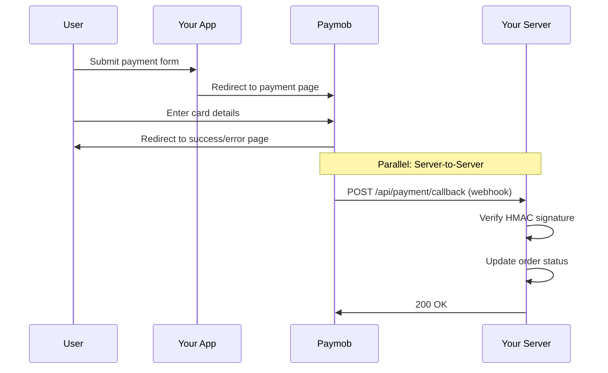

# Paymob Testing Guide

Complete guide for testing the Paymob payment integration in your e-commerce application.

## Table of Contents

1. [Environment Setup](#environment-setup)
2. [Paymob Dashboard Configuration](#paymob-dashboard-configuration)
3. [Test Cards](#test-cards)
4. [Testing Flow](#testing-flow)
5. [Webhook Testing](#webhook-testing)
6. [Common Issues & Solutions](#common-issues--solutions)
7. [Verification Checklist](#verification-checklist)

---

## Environment Setup

### Required Environment Variables

Create or update your `.env` file with the following Paymob credentials:

```bash
# Paymob Configuration
PAYMOB_API_KEY="your_api_key_here"
PAYMOB_INTEGRATION_ID="your_integration_id_here"
PAYMOB_IFRAME_ID="your_iframe_id_here"
PAYMOB_HMAC_SECRET="your_hmac_secret_here"
```

### Where to Find These Values

1. **PAYMOB_API_KEY**

   - Log in to [Paymob Dashboard](https://accept.paymob.com/portal2/en/login)
   - Navigate to: **Settings** → **Account Info** → **API Keys**
   - Copy your **Secret Key** (not the Public Key)

2. **PAYMOB_INTEGRATION_ID**

   - Navigate to: **Developers** → **Payment Integrations**
   - Find your **Card Payment Integration**
   - Copy the **Integration ID** (numeric value)

3. **PAYMOB_IFRAME_ID**

   - Navigate to: **Developers** → **iFrames**
   - Find or create your custom iframe
   - Copy the **iFrame ID** (numeric value)

4. **PAYMOB_HMAC_SECRET**
   - Navigate to: **Developers** → **HMAC Calculation**
   - Copy the **HMAC Secret**

### Quick Configuration Test

Run the test script to verify your environment is configured correctly:

```bash
cd /mnt/hdd/projects/e-commerce
npx tsx scripts/test-paymob.ts
```

**Expected Output:**

```
============================================================
  Paymob Integration Test
============================================================

Step 1: Checking Environment Variables...

✅ PAYMOB_API_KEY: Set (ZXlKaGJHY...)
✅ PAYMOB_INTEGRATION_ID: Set (1234567...)
✅ PAYMOB_IFRAME_ID: Set (9876543...)
✅ PAYMOB_HMAC_SECRET: Set (A1B2C3D4E5...)

✅ All environment variables are configured

Step 2: Testing Authentication...

✅ Authentication successful
ℹ️  Token: eyJhbGciOiJIUz...

... (more steps)

✅ All tests passed!
```

---

## Paymob Dashboard Configuration

### 1. Create Custom iFrame

If you haven't created a custom iframe yet:

1. Navigate to **Developers** → **iFrames** → **Add Iframe**
2. Fill in the fields using content from `docs/paymob_iframe_code.md`:
   - **HTML Content**: Copy HTML section
   - **CSS Content**: Copy CSS section
   - **JavaScript Content**: Copy JavaScript section
3. Save and copy the **iframe ID**

### 2. Configure Webhook URL

> [!IMPORTANT]
> Webhooks are CRITICAL for payment verification. Never trust client-side redirects alone.

#### For Production (Deployed Application)

1. Navigate to **Developers** → **Transaction Processed Callback**
2. Set URL to: `https://yourdomain.com/api/payment/callback`
3. Save changes

#### For Local Development (Using ngrok)

1. Install ngrok: `npm install -g ngrok` or download from [ngrok.com](https://ngrok.com)
2. Start your dev server: `npm run dev`
3. In another terminal, expose it: `ngrok http 3000`
4. Copy the HTTPS URL (e.g., `https://abc123.ngrok.io`)
5. In Paymob dashboard, set callback to: `https://abc123.ngrok.io/api/payment/callback`

> [!WARNING]
> ngrok URLs change every time you restart. Remember to update the callback URL in Paymob dashboard each time.

---

## Test Cards

### Official Paymob Test Cards

Use these test card numbers in the **TEST environment only**:

#### ✅ Successful Payment

```
Card Number: 4987654321098769
Expiry: Any future date (e.g., 12/25)
CVV: 123
Cardholder Name: Any name
```

#### ❌ Declined Payment

```
Card Number: 5123456789012346
Expiry: Any future date
CVV: 123
Cardholder Name: Any name
```

#### 🔐 3D Secure Test

```
Card Number: 5111111111111118
Expiry: Any future date
CVV: 123
Cardholder Name: Any name
```

> [!TIP]
> For 3D Secure testing, Paymob will show a test authentication screen. Use any OTP like `123456`.

---

## Testing Flow

### Step-by-Step Payment Flow Test

#### 1. Start Development Server

```bash
cd /mnt/hdd/projects/e-commerce
npm run dev
```

#### 2. Navigate to Checkout

- Open browser: http://localhost:3000
- Add products to cart
- Click "Checkout" or "Proceed to Checkout"

#### 3. Fill Checkout Form

Use test data:

```
Name: Ahmed Test
Email: ahmed.test@example.com
Phone: 01234567890  (Egyptian format)
Address: 123 Test Street
City: Cairo
Payment Method: Select "Paymob" / "Credit Card"
```

> [!NOTE] > **Phone Number Formatting**: The system automatically normalizes Egyptian phone numbers:
>
> - `01234567890` → `201234567890`
> - `201234567890` → `201234567890` (already correct)
> - `+201234567890` → `201234567890` (removes +)

#### 4. Place Order

- Click "Place Order" button
- **Expected**: You should be redirected to Paymob's payment page

> [!WARNING]
> If you see an error instead of redirect:
>
> - Check browser console for errors
> - Check server logs for Paymob API errors
> - Verify environment variables are set correctly

#### 5. Complete Payment

- On Paymob page, enter test card details (see [Test Cards](#test-cards))
- Click "Pay"
- **Expected**: Redirect back to success page

#### 6. Verify in Database

Check that the following happened:

**Orders Table:**

```sql
SELECT id, status, isPaid, total FROM "Order"
WHERE id = 'your_order_id';

-- Expected:
-- status: 'PAID'
-- isPaid: true
```

**Payments Table:**

```sql
SELECT * FROM "Payment"
WHERE orderId = 'your_order_id';

-- Expected: One record with:
-- provider: 'PAYMOB'
-- status: 'SUCCESS'
-- transactionId: (unique ID from Paymob)
```

**Products Table:**

```sql
SELECT id, name, stock FROM "Product"
WHERE id IN (/* your product IDs */);

-- Expected: Stock decreased by ordered quantity
```

---

## Webhook Testing

### Understanding Webhooks

**Why Webhooks Matter:**

- Client-side redirects can be manipulated
- Webhooks are server-to-server (secure)
- Paymob sends the FINAL payment status via webhook
- Your app should ONLY trust webhook data (verified with HMAC)

### Webhook Flow



### Testing Webhook Locally

#### Method 1: Using ngrok (Recommended)

1. **Start your dev server:**

   ```bash
   npm run dev
   ```

2. **Start ngrok in another terminal:**

   ```bash
   ngrok http 3000
   ```

3. **Copy the HTTPS URL** (e.g., `https://abc123.ngrok-free.app`)

4. **Update Paymob webhook URL:**

   - Paymob Dashboard → Developers → Transaction Processed Callback
   - Set to: `https://abc123.ngrok-free.app/api/payment/callback`

5. **Complete a test payment** (follow [Testing Flow](#testing-flow))

6. **Check server logs** for webhook receipt:

   ```
   📦 Paymob Register Order Payload: {...}
   ✅ Paymob order registered successfully (ID: 12345)
   🔑 Paymob Payment Key Request: {...}
   ✅ Paymob payment key generated successfully

   # After payment completion:
   Paymob Debug - Received HMAC: abc123...
   Paymob Debug - Calculated HMAC: abc123...
   ✅ HMAC verified
   ✅ Payment processed successfully
   ```

#### Method 2: Postman Testing (Manual Webhook)

Use this to test webhook handling without completing full payment:

1. **Create test webhook payload** (`test-webhook.json`):

```json
{
  "obj": {
    "id": 123456789,
    "pending": false,
    "amount_cents": 10000,
    "success": true,
    "is_auth": false,
    "is_capture": false,
    "is_standalone_payment": true,
    "is_voided": false,
    "is_refunded": false,
    "is_3d_secure": false,
    "integration_id": YOUR_INTEGRATION_ID,
    "profile_id": 123456,
    "has_parent_transaction": false,
    "order": {
      "id": 987654321,
      "merchant_order_id": "your_test_order_id"
    },
    "created_at": "2024-12-05T12:00:00.000000",
    "currency": "EGP",
    "source_data": {
      "type": "card",
      "pan": "1234",
      "sub_type": "CARD"
    },
    "error_occured": false,
    "owner": 123456
  }
}
```

2. **Generate HMAC signature:**

   ```bash
   # Run this in Node.js or add to test script
   const crypto = require('crypto');
   const data = /* your obj from above */;
   const keys = [
     "amount_cents", "created_at", "currency", "error_occured",
     "has_parent_transaction", "id", "integration_id", "is_3d_secure",
     "is_auth", "is_capture", "is_refunded", "is_standalone_payment",
     "is_voided", "order", "owner", "pending", "source_data.pan",
     "source_data.sub_type", "source_data.type", "success"
   ];

   const concatenated = keys.map(key => {
     let value = key.split('.').reduce((obj, k) => obj?.[k], data);
     if (key === 'order' && typeof value === 'object') value = value.id;
     return value !== undefined ? value.toString() : '';
   }).join('');

   const hmac = crypto.createHmac('sha512', process.env.PAYMOB_HMAC_SECRET)
     .update(concatenated)
     .digest('hex');
   console.log('HMAC:', hmac);
   ```

3. **Send POST request with Postman:**
   - URL: `http://localhost:3000/api/payment/callback?hmac=YOUR_CALCULATED_HMAC`
   - Method: POST
   - Headers: `Content-Type: application/json`
   - Body: Your test webhook payload
   - Expected Response: `Received` (200 OK)

---

## Common Issues & Solutions

### Issue 1: "Authentication failed"

**Symptoms:**

```
❌ Paymob Authentication Error: Authentication failed
```

**Causes & Solutions:**

- ❌ **Wrong API Key**: Double-check you copied the **Secret Key**, not Public Key
- ❌ **Extra spaces**: Ensure no trailing spaces in `.env` file
- ❌ **Test vs Live**: Make sure you're using keys from the correct environment

**Fix:**

```bash
# Verify your API key
npx tsx scripts/test-paymob.ts
```

---

### Issue 2: "Invalid HMAC Signature" (403 Error)

**Symptoms:**

```
❌ Invalid Paymob HMAC Signature
```

**Causes & Solutions:**

- ❌ **Wrong HMAC Secret**: Verify you copied the correct HMAC secret
- ❌ **Webhook from wrong environment**: Test webhooks use different secrets than live
- ❌ **Manual testing without proper HMAC**: If testing with Postman, you must calculate HMAC correctly

**Debug:**
Check server logs for HMAC comparison:

```
Paymob Debug - Received HMAC: abc123...
Paymob Debug - Calculated HMAC: def456...
```

If these don't match, your HMAC secret is wrong.

---

### Issue 3: Phone Number Rejected

**Symptoms:**

```
❌ Paymob Payment Key Failed: Invalid phone number format
```

**Solution:**
Egyptian phone numbers must be in format: `201234567890` (12 digits, starting with `20`)

The system auto-formats, but if issues persist:

- Remove any spaces, dashes, or parentheses
- Don't include `+` symbol
- Should start with `01` (will be converted to `201`)

---

### Issue 4: Payment appears successful but order not updated

**Symptoms:**

- User sees success page
- Order status still `PENDING`
- No payment record in database

**Causes & Solutions:**

- ❌ **Webhook not configured**: Paymob can't reach your server
- ❌ **Webhook URL wrong**: Check it's set to `/api/payment/callback`
- ❌ **HMAC verification failing**: Check server logs for "Invalid Signature"
- ❌ **Server error in webhook handler**: Check server logs for errors

**Debug Steps:**

1. Check Paymob dashboard for webhook delivery status
2. Check server logs immediately after payment
3. If using ngrok, ensure it's still running
4. Test webhook manually with Postman (see Webhook Testing section)

---

### Issue 5: "Insufficient stock" error

**Symptoms:**

```
❌ Checkout Error: Insufficient stock for ProductName
```

**Solution:**
Check product stock in database:

```sql
SELECT id, name, stock FROM "Product" WHERE id = 'product_id';
```

If stock is 0, either:

- Update stock in admin panel
- Or add more stock directly in database:
  ```sql
  UPDATE "Product" SET stock = 10 WHERE id = 'product_id';
  ```

---

### Issue 6: Duplicate payment processing

**Symptoms:**

- Same payment processed twice
- Duplicate `Payment` records
- Stock decremented twice

**This should NOT happen** if idempotency is working. Debug:

1. **Check for unique constraint:**

   ```sql
   -- This should return a constraint
   SELECT * FROM pg_constraint
   WHERE conname LIKE '%transactionId%';
   ```

2. **Check webhook logs** - should see:

   ```
   Already Processed (200 OK)
   ```

   On duplicate webhook delivery

3. **If issue persists**, check `app/api/payment/callback/route.ts` for idempotency logic

---

## Verification Checklist

After completing tests, verify:

### ✅ Environment Configuration

- [ ] All 4 environment variables set in `.env`
- [ ] Test script passes: `npx tsx scripts/test-paymob.ts`
- [ ] No missing env variable warnings in server logs

### ✅ Paymob Dashboard

- [ ] API Key copied correctly
- [ ] Integration ID is for "Card Payment"
- [ ] iFrame created with custom HTML/CSS
- [ ] Webhook URL configured (production or ngrok for local)

### ✅ Payment Flow

- [ ] Checkout form accepts valid data
- [ ] Clicking "Place Order" redirects to Paymob
- [ ] Test card payment completes successfully
- [ ] User redirected back to success page
- [ ] Order appears in user's order history

### ✅ Database Updates

- [ ] Order status changed from `PENDING` to `PAID`
- [ ] Order `isPaid` field set to `true`
- [ ] `Payment` record created with correct transaction ID
- [ ] Product stock decremented correctly

### ✅ Webhook Verification

- [ ] Webhook receives POST requests from Paymob
- [ ] HMAC signature verification passes
- [ ] Server logs show "✅ HMAC verified"
- [ ] Duplicate webhook properly ignored (idempotency)

### ✅ Error Handling

- [ ] Declined card shows appropriate error
- [ ] Invalid data shows validation errors
- [ ] Out-of-stock products can't be ordered
- [ ] Server errors logged but don't expose secrets

---

## Next Steps

Once all tests pass:

1. **Switch to Live Credentials**: Replace test credentials with production credentials from Paymob
2. **Update Webhook URL**: Point to your production domain
3. **Test with Real Card**: Do a small real transaction (e.g., 1 EGP)
4. **Monitor Logs**: Watch for any production issues
5. **Set up Error Monitoring**: Consider using Sentry or similar for production error tracking

---

## Support

If you encounter issues not covered here:

1. **Check Paymob Documentation**: [https://docs.paymob.com](https://docs.paymob.com)
2. **Contact Paymob Support**: support@paymob.com
3. **Review Server Logs**: Most issues show detailed error messages in logs
4. **Run Test Script**: `npx tsx scripts/test-paymob.ts` pinpoints configuration issues

---

**Last Updated**: December 5, 2024
