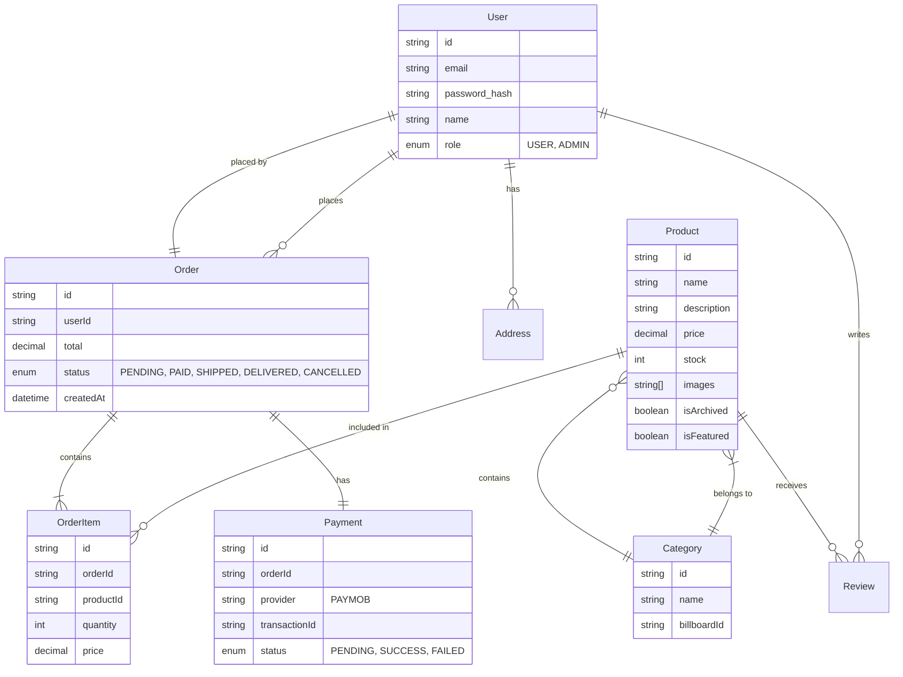

# Database Design - Zamalek Store

## 1. Entity Relationship Diagram (ERD)



## 2. Recommended Prisma Schema

This schema is designed to work with PostgreSQL.

```prisma
generator client {
  provider = "prisma-client-js"
  previewFeatures = ["driverAdapters"]
}

datasource db {
  provider = "postgresql"
  url      = env("DATABASE_URL")
}

enum Role {
  USER
  ADMIN
}

enum OrderStatus {
  PENDING
  PAID
  SHIPPED
  DELIVERED
  CANCELLED
}

model User {
  id            String    @id @default(cuid())
  name          String?
  email         String    @unique
  emailVerified DateTime?
  image         String?
  password      String?
  role          Role      @default(USER)
  createdAt     DateTime  @default(now())
  updatedAt     DateTime  @updatedAt

  orders        Order[]
  addresses     Address[]
  reviews       Review[]
  accounts      Account[] // For NextAuth
  sessions      Session[] // For NextAuth
}

model Product {
  id          String      @id @default(cuid())
  name        String
  description String
  price       Decimal     @db.Decimal(10, 2)
  stock       Int         @default(0)
  images      String[]
  isFeatured  Boolean     @default(false)
  isArchived  Boolean     @default(false)
  createdAt   DateTime    @default(now())
  updatedAt   DateTime    @updatedAt

  categoryId  String
  category    Category    @relation(fields: [categoryId], references: [id])
  orderItems  OrderItem[]
  reviews     Review[]
}

model Category {
  id        String    @id @default(cuid())
  name      String
  products  Product[]
  createdAt DateTime  @default(now())
  updatedAt DateTime  @updatedAt
}

model Order {
  id        String      @id @default(cuid())
  userId    String
  user      User        @relation(fields: [userId], references: [id])
  status    OrderStatus @default(PENDING)
  total     Decimal     @db.Decimal(10, 2)
  isPaid    Boolean     @default(false)
  phone     String      @default("")
  address   String      @default("")
  createdAt DateTime    @default(now())
  updatedAt DateTime    @updatedAt

  orderItems OrderItem[]
  payment    Payment?
}

model OrderItem {
  id        String  @id @default(cuid())
  orderId   String
  order     Order   @relation(fields: [orderId], references: [id], onDelete: Cascade)
  productId String
  product   Product @relation(fields: [productId], references: [id])
  quantity  Int
  price     Decimal @db.Decimal(10, 2) // Snapshot of price at time of purchase
}

model Payment {
  id            String   @id @default(cuid())
  orderId       String   @unique
  order         Order    @relation(fields: [orderId], references: [id])
  provider      String   @default("PAYMOB")
  transactionId String? // ID from Paymob
  amount        Decimal  @db.Decimal(10, 2)
  status        String   // e.g., "SUCCESS", "PENDING", "FAILED"
  createdAt     DateTime @default(now())
}

model Address {
  id        String   @id @default(cuid())
  userId    String
  user      User     @relation(fields: [userId], references: [id], onDelete: Cascade)
  street    String
  city      String
  state     String
  zip       String
  country   String
  createdAt DateTime @default(now())
}

model Review {
  id        String   @id @default(cuid())
  rating    Int
  comment   String?
  userId    String
  user      User     @relation(fields: [userId], references: [id], onDelete: Cascade)
  productId String
  product   Product  @relation(fields: [productId], references: [id], onDelete: Cascade)
  createdAt DateTime @default(now())
}

// NextAuth Models
model Account {
  id                 String  @id @default(cuid())
  userId             String
  type               String
  provider           String
  providerAccountId  String
  refresh_token      String? @db.Text
  access_token       String? @db.Text
  expires_at         Int?
  token_type         String?
  scope              String?
  id_token           String? @db.Text
  session_state      String?

  user User @relation(fields: [userId], references: [id], onDelete: Cascade)

  @@unique([provider, providerAccountId])
}

model Session {
  id           String   @id @default(cuid())
  sessionToken String   @unique
  userId       String
  expires      DateTime
  user         User     @relation(fields: [userId], references: [id], onDelete: Cascade)
}

model VerificationToken {
  identifier String
  token      String   @unique
  expires    DateTime

  @@unique([identifier, token])
}
```
